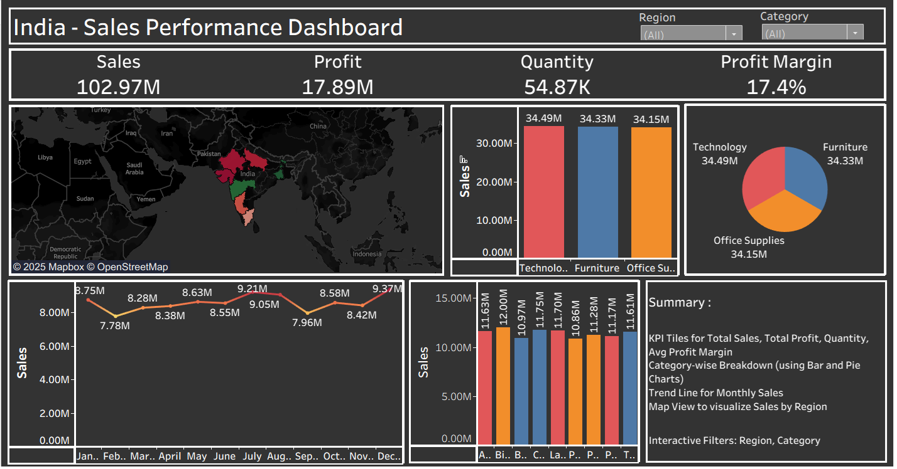

## 📊 Sales Performance Dashboard (Bharath / India)
Overview
This Tableau dashboard presents a comprehensive view of sales performance across India, enabling executives and analysts to monitor key metrics, identify trends, and make data-driven decisions. It combines interactive visuals, regional insights, and category-level breakdowns to deliver a clear and actionable story.

## 📊 Features
- Top KPIs (auto-calculated from full dataset
- 💰 Total Sales
- 📈 Total Profit
- 📦 Quantity Sold
- 🧮 Profit Margin
---
## Visual Highlights:
- 🗺️ Map View: Regional performance across India
- 📊 Bar & Pie Charts: Category-wise sales distribution
- 📈 Monthly Trend Line: Seasonality and growth tracking
- 🏙️ Regional Breakdown: Sales by major zones
---
## 🛠️ Tools & Technologies
- Tableau Desktop
- Calculated Fields
- Excel as the data source
---
## 🎯 Use Cases
- Executive sales reviews and quarterly planning
- Regional performance benchmarking
- Category-level profitability analysis
- Portfolio showcase for data storytelling and dashboard design
---
## 📷 Dashboard Preview

## 👤 Author
- Created by **[Girish Kumar V]**
- 📧 Contact: [girishaquarius@gmail.com]
---
⭐ If you find this useful, consider giving this repo a star!
